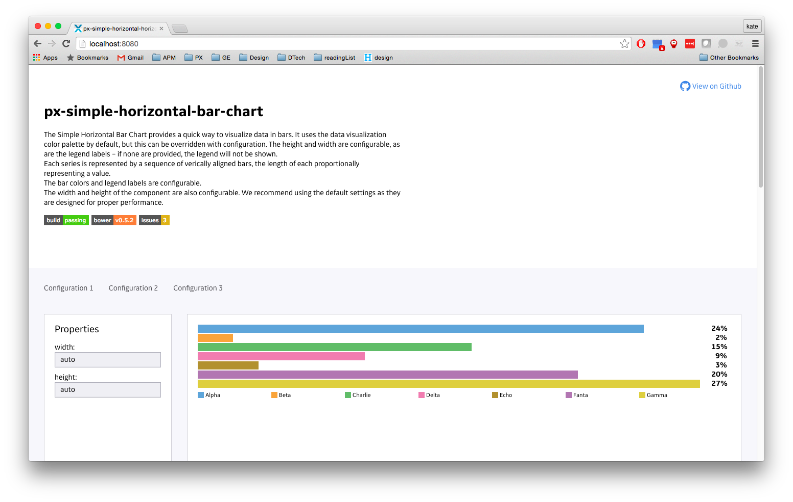

#Px-Simple-Horizontal-Bar-Chart [](https://travis-ci.org/PredixDev/px-simple-horizontal-bar-chart)

[](https://github.com/PredixDev/px-simple-horizontal-bar-chart)

## Overview

Px-Simple-Horizontal-Bar-Chart is a Predix UI component.

Use this component to visualize a series of numeric values as a horizontally-oriented bar chart. The series is represented by horizontally left-aligned rectangle bars, the width of each proportionally representing a value.

The bar colors and legend labels are configurable. The width and height of the component are also configurable. We recommend viewing the `demo.html` page to become aware of the configuration possibilities. We also recommend using the default settings as they are designed for proper performance.

## Usage

### Prerequisites
1. node.js
2. npm
3. bower
4. [webcomponents-lite.js polyfill](https://github.com/webcomponents/webcomponentsjs)

Node, npm and bower are necessary to install the component and dependencies. webcomponents.js adds support for web components and custom elements to your application.

### Getting Started

First, install the component via bower on the command line.

```
bower install px-simple-horizontal-bar-chart --save
```

Second, import the component to your application with the following tag in your head.

```
<link rel="import" href="/bower_components/px-simple-horizontal-bar-chart/px-simple-horizontal-bar-chart.html"/>
```

Finally, use the component in your application:

```
<px-simple-horizontal-bar-chart
    ...
    width="370"
    height="230">
</px-simple-horizontal-bar-chart>
```

<br />
<hr />

## documentation

Due to a bug in auto-documenting Attributes specified in Behaviors, we are listing the following attributes here, and will move them into the auto documentation API when the bug is fixed:

### Attributes

#### width

Define the target pixel width of the chart component. The default settings is 283.

If you set both this and height to "auto", the chart will expand to fill its containing element. *Note: The parent containing element must be a block-level element or have a defined width/height so that the component can inherit the value.*

```html
<px-simple-horizontal-bar-chart
    ...
    width="370">
</px-simple-horizontal-bar-chart>
```
#### height

Define the target pixel height of the chart component. The default settings is 150.

If you set both this and width to "auto", the chart will expand to fill its containing element. *Note: The parent containing element must be a block-level element or have a defined width/height so that the component can inherit the value.*

```html
<px-simple-horizontal-bar-chart
    ...
    height="370">
</px-simple-horizontal-bar-chart>
```

Read the full API and view the demo [here](https://predixdev.github.io/px-simple-horizontal-bar-chart/).

## Local Development

From the component's directory...

```
$ npm install
$ bower install
$ grunt sass
```

From the component's directory, to start a local server run:

```
$ grunt depserve
```

Navigate to the root of that server (e.g. http://localhost:8080/) in a browser to open the API documentation page, with link to the "Demo" / working examples.

### DevMode
Devmode runs `grunt depserve` and `grunt watch` concurrently so that when you make a change to your source files and save them, your preview will be updated in any browsers you have opened and turned on LiveReload.
From the component's directory run:

```
$ grunt devmode
```

### GE Coding Style Guide
[GE JS Developer's Guide](https://github.com/GeneralElectric/javascript)

<br />
<hr />

## Known Issues

Please use [Github Issues](https://github.com/PredixDev/px-simple-horizontal-bar-chart/issues) to submit any bugs you might find.
